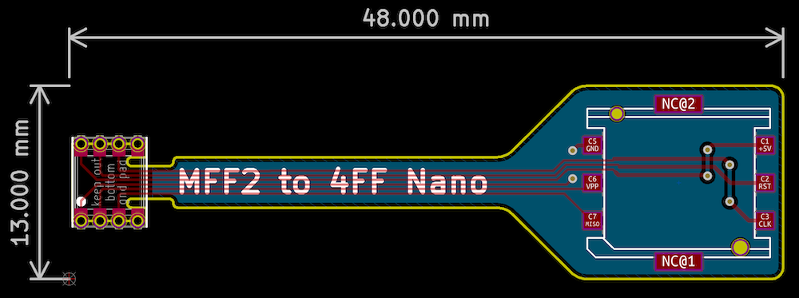
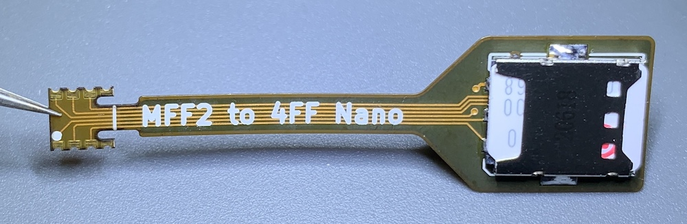
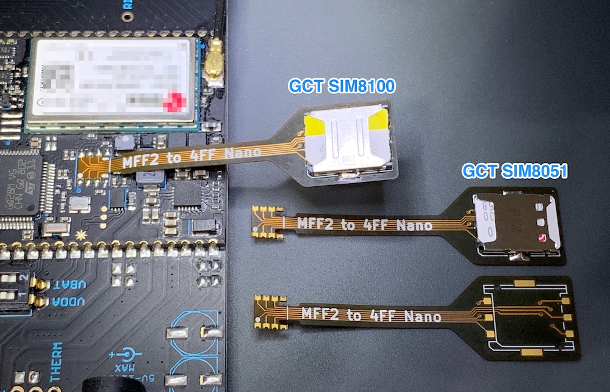

MFF2 to 4FFNano Adapter
===

BOM and Parts ordering
===

The BOM is so simple, there's no need for a separate CSV file:

- 4FF Nano SIM holder - [GCT SIM8051 (Active)](https://www.digikey.com/en/products/detail/gct/SIM8051-6-0-14-01-A/9859628) or GCT SIM8100 (Obsolete)

Ordering PCB's
===

OSHPark [Shared Project here](https://oshpark.com/shared_projects/lbskvdGm)

Another way to order PCB's is by using the included [gerbers](gerbers/mff2-to-4ffnano-v1.0.zip) and uploading those with all of the necessary specs to companies like [PCBWay](https://www.pcbway.com) or [OSHPark](https://www.oshpark.com)

LICENSE
===

Creative Commons Attribution-ShareAlike 4.0 International (CC BY-SA 4.0) - Full [LICENSE here](LICENSE)
